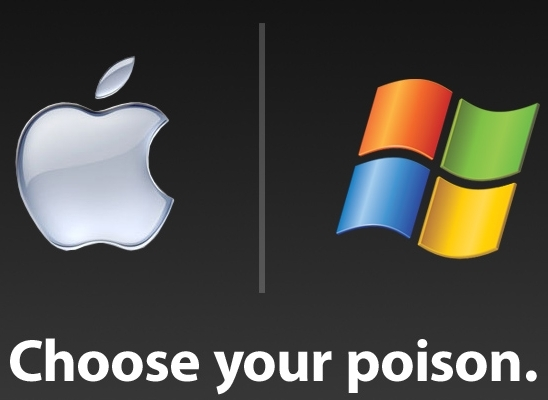
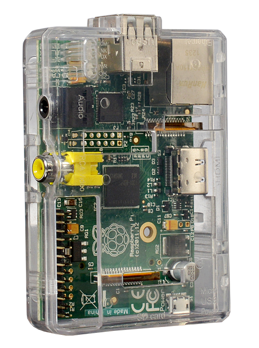
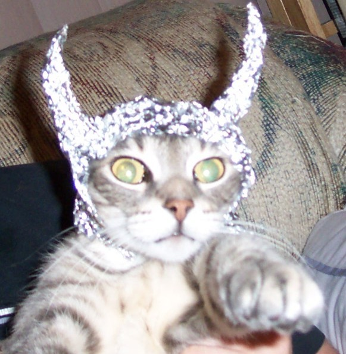
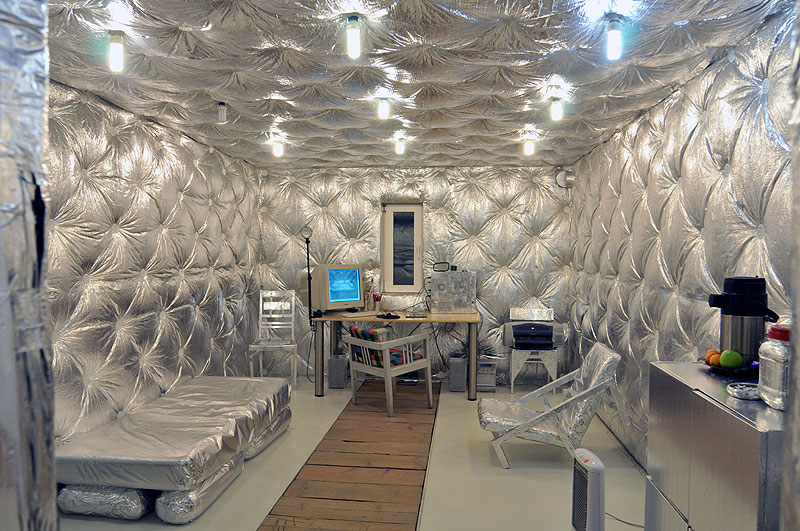

#GPG

Confidentialité du contenu des échanges par courriel.

!

#Plan de l'atelier

1. Blabla
    * phrases de passe
    * chiffrement
    * cryptographie à clef publique
    * GPG: mail & autres applications
    * utilisation smartcard

2. Atelier Pizza optionnel (PAF 5€)

3. Atelier GPG
    * installation GPG, Thunderbird, Enigmail
    * création de votre paire de clefs
    * échange des clefs entre participants
    * vérification et signature des clefs
    * envoi & réception de mails chiffrés

4. Bière jusqu'à l'aube

!

# PGP / OpenPGP / GPG / GnuPG ????

* PGP: Pretty Good Privacy 
* Phil Zimmermann 1991
* OpenPGP: standard d'Internet RFC 4880
* GPG: Gnu Privacy Guard
    * **logiciel libre** sous licence GPL
    * g10 Code, société allemande dirigée par Werner Koch
    * 1999: version 1.0.0
    * 2006: version 2.0

!

# Logiciel libre?

* Que fait réellement mon ordinateur, mon téléphone, mon logiciel?
* Mon ordinateur est-il encore mon ami?

Ordinateur rempli de logiciels non-libres:

!

# Logiciels non-libres ou propriétaires

* code source fermé
* mécanisme interne: secret commercial

!

# Logiciel libre

* libre accès au code source
* accès aux mécanismes internes du logiciel, du système d'exploitation

Ordinateur avec du logiciel libre dedans:

!

# Logiciel libre

!

# Chiffrement

Classiquement:

* 1 seule clef pour chiffrer et déchiffrer
* Chiffrement dit "symétrique"

!

#Chiffrement symétrique

Avantages:

* rapide
* clef courte 128, 192, 256 bits

!

#Chiffrement symétrique

Inconvénients du chiffrement symétrique pour les mails:

* Comment envoyer la clef sans se la faire piquer?
* 1 clef différente par couple expéditeur-destinataire, ça fait beaucoup de clefs

!

Comment envoyer un message chiffré... sans envoyer la clef de chiffrement?

Casse-tête majeur pour les mathématiciens et experts en cryptologie...

La solution en vidéo!

!

#Cryptographie à clef publique

* "cryptographie asymétrique"
* concept 1976 Diffie & Hellman
* mise en pratique en 1978 par
    * **R**ivest
    * **S**hamir
    * **A**dleman
* **RSA** est l'algorithme de chiffrement asymétrique le plus utilisé dans GPG
* clefs longues: 1024, 2048, 3072, 4096
!

#GPG en pratique 1

Si elle veut pouvoir recevoir des mails chiffrés, Alice doit créer une paire de clefs grâce à GPG:

1 clef **publique** verte

1 clef **privée** rouge

!

#GPG en pratique 2

Bob va récupérer la clef publique d'Alice:

Notez bien que la clef privée d'Alice doit rester secrète et cachée au fond de son ordinateur, protégée par une phrase de passe sûre.

!

#GPG en pratique 3

1. Bob va chiffrer son message grâce à GPG en utilisant la clef publique d'Alice.
2. Bob va envoyer son message chiffré à travers le "méchant" Internet.
3. Alice va utilisée sa clef privée pour déchiffrer **temporairement** le message de Bob.

Notez bien qu'Alice est la seule personne à avoir accès à sa clef privée, et que GPG lui demandera sa phrase de passe avant de s'en servir.

!

#Voilà!

Vous savez l'essentiel!

Quelques remarques:

Si Alice oublie sa phrase de passe ou si son disque dur tombe en panne: adieu veau, vache, cochon, couvée!

Alice devra créer une nouvelle paire de clefs... et révoquer l'ancienne paire.

D'où l'intérêt de génerer une **certificat de révocation**.

Elle ne pourra plus jamais lire ses anciens mails, qui sont stockés sous forme chiffrée!

!

#GPG: longueur des clefs (RSA)

* 768 bits: cassé en 2010 [voir l'article][article]
* 1024 bits: proche de 768, ne plus utiliser!
* 2048 bits: valeur recommandée pour SSL, sûre jusqu'en 2025-2030 (smartphone, PC antique)
* 3072 bits: sûr au delà de 2030
* 4096 bits: a la faveur des paranoïaques, clefs primaires à long terme, lent sur smartphone
* au délà: risque d'incompatibilité avec certains logiciels, *TIN FOIL HAT ZONE!* :)

[article]: http://eprint.iacr.org/2010/006.pdf "Factorization of a 768-bit RSA modulus February 18, 2010, Kleijung et. al"

!

#Tin-foil hat 1

!

#Tin-foil hat 2
Dave Grohl, batteur de Nirvana

"Just because you're paranoid, don't mean they're not after you"

Territorial Pissings, Nirvana.

!

#Tin-foil hut

!

# Que fait GPG ?

* Confidentialité
    * Chiffrement du message
    * Déchiffrement du message
* Signature du message
    * authentification de l'expéditeur
    * intégrité du message
* Création des paires de clefs
* Gestion des clés
* Certification des clefs
* Révocation des clefs compromises

!

!

# Applications de GPG

* Email bien sûr, mais pas que...
* 
*

!

# "The Crypto Wars"

* Zimmermann: activiste pacifiste et antinucléaire
* 1993 Zimmermann devient la cible d'1 enquête criminelle de la part du gouvernement américain
* "Exportation de munitions sans licence"
* crypto avec clef > 40 bits considérée comme munitions
* PGP: clefs de 128 bits (1993)
* publication du code source du programme en version papier! Livre protégé par 1er amendement 
* 1996 enquête fédérale criminelle abandonnée sans mise en examen de Zimmermann
* démilitarisation de la "crypto forte"  = nécessité économique du chiffrement? (banque, e-commerce)

!

# Serveurs de clés

* Comment Alice peut récupérer la clef publique de Bob?
    * Bob envoie sa clef publique à Alice par mail, en pièce jointe
    * Bob transmet sa clef publique à Alice via 1 clef USB
    * Bob dépose sa clef publique sur un serveur de clefs... et Alice va la récupérer.

!

# Serveur de clés

* serveurs sks: sorte d'annuaires reliés entre eux
* y déposer sa paire de clefs n'est pas obligatoire
* 1 clef déposée y restera pour toujours mais...
* 1 clef peut-être révoquée
* [https://sks-keyservers.net/](https://sks-keyservers.net/)

!

# Web of Trust

* Toile de confiance
* On ne peut physiquement vérifier qu'un nombre limité de clés
* Signature des clés

!

# GPG: avantages

* basé sur le mail, service connu et très accessible
* chiffrement
